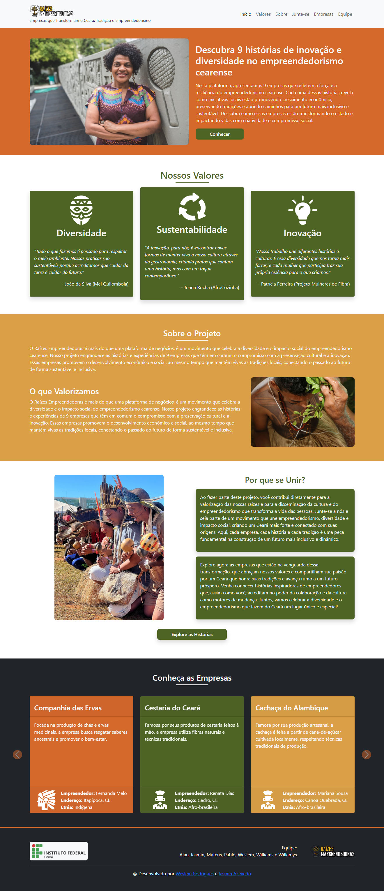

# Raízes Empreendedoras 🌱✨

## Sobre o Projeto

O **Raízes Empreendedoras** é uma plataforma inovadora que celebra e promove a diversidade do empreendedorismo no Ceará. Com foco em 9 empresas de diferentes etnias, o projeto busca conectar a preservação cultural com a inovação, promovendo o desenvolvimento econômico e social de forma sustentável.

### Objetivos do Projeto:
- Promover o empreendedorismo cearense com um foco cultural e social.
- Conectar empresas que valorizam a preservação cultural com o público em geral.
- Incentivar o impacto social e econômico de negócios locais.

## Desenvolvedores 👨‍💻👩‍💻

Este projeto foi desenvolvido por:

- **Weslem Rodrigues e Silva** - Desenvolvedor
- **Iasmin Azevedo** - Colaboradora no Desenvolvimento
- **Williams** - Designer Gráfico, responsável pela criação da logo

## Funcionalidades principais 🔍

- Informações detalhadas sobre cada empresa, incluindo etnia, empreendedor e impacto social.
- Interface visual amigável, ideal para o público jovem.

## Tecnologias Utilizadas 🛠️

- **HTML5**
- **CSS3**
- **JavaScript**
- **Bootstrap**

## Imagem da Landing Page 🌍

---

### Instituto Federal de Educação, Ciência e Tecnologia do Ceará - IFCE
**Campus Boa Viagem**
